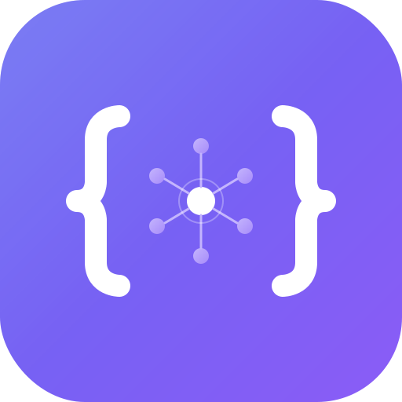

<p align="center">
  
</p>

<h1 align="center">AutoSoftware</h1>

<p align="center">
  <strong>AI-powered code analysis and improvement platform</strong>
</p>

<p align="center">
  Connect your GitHub, GitLab, or Bitbucket repositories &mdash; let AI scan for issues and deliver fixes as pull requests.
</p>

<p align="center">
  <a href="#features">Features</a> &bull;
  <a href="#getting-started">Getting Started</a> &bull;
  <a href="#docker">Docker</a> &bull;
  <a href="#architecture">Architecture</a> &bull;
  <a href="#contributing">Contributing</a> &bull;
  <a href="#license">License</a>
</p>

---

## Features

- **Automated scanning** &mdash; Periodic AI-powered analysis of your codebase for bugs, security issues, performance bottlenecks, and code quality improvements
- **Task management** &mdash; Tracks discovered issues with type, priority, and status
- **Autonomous fixes** &mdash; AI agent creates branches and opens pull requests using the Claude Agent SDK
- **File browser** &mdash; GitHub-style code viewer with syntax highlighting
- **Project grouping** &mdash; Organize repos into projects with shared context documents
- **External integrations** &mdash; Sync tasks with Linear, Jira, Asana, Azure DevOps, Sentry, and GitHub Issues
- **Embeddable widget** &mdash; Collect feature requests and bug reports from external users, with AI-powered screening and automatic task conversion
- **API key management** &mdash; Per-repository usage and cost tracking
- **Job queue dashboard** &mdash; Monitor background jobs in real time
- **Activity feed** &mdash; Full event stream and audit trail

## Getting Started

### Prerequisites

- **Node.js** 22+
- **PostgreSQL** 16+
- **Anthropic API key** ([get one here](https://console.anthropic.com/))
- OAuth credentials for at least one Git provider (GitHub, GitLab, or Bitbucket)

### Setup

```bash
# Clone the repository
git clone https://github.com/your-org/autosoftware.git
cd autosoftware

# Install dependencies
npm install

# Configure environment
cp .env.example .env
```

Edit `.env` and fill in the required values:

| Variable | Description |
|----------|-------------|
| `DATABASE_URL` | PostgreSQL connection string |
| `ANTHROPIC_API_KEY` | Your Anthropic API key |
| `SESSION_SECRET` | Random string &mdash; generate with `openssl rand -hex 32` |
| `API_KEY_ENCRYPTION_SECRET` | Random string &mdash; generate with `openssl rand -hex 32` |
| `GITHUB_CLIENT_ID` / `GITHUB_CLIENT_SECRET` | GitHub OAuth app credentials |
| `GITLAB_CLIENT_ID` / `GITLAB_CLIENT_SECRET` | GitLab OAuth app credentials (optional) |
| `BITBUCKET_CLIENT_ID` / `BITBUCKET_CLIENT_SECRET` | Bitbucket OAuth app credentials (optional) |
| `FRONTEND_URL` | Frontend URL (default: `http://localhost:5001`) |
| `BACKEND_URL` | Backend URL (default: `http://localhost:5002`) |

You need at least one Git provider configured to log in.

```bash
# Run database migrations
npx prisma migrate dev

# Start all services (frontend + backend + worker)
npm run dev
```

The app will be available at **http://localhost:5001**.

### Individual Services

```bash
npm run dev:backend    # Backend API (port 5002)
npm run dev:worker     # Background job processor
npm run dev:frontend   # Frontend dev server (port 5001)
```

### Other Commands

```bash
npm run build          # Build all packages
npm run typecheck      # Type-check all packages
npm run db:migrate     # Run Prisma migrations
npm run db:generate    # Regenerate Prisma client
```

## Docker

### Development

```bash
docker-compose up
```

This starts PostgreSQL alongside the application services.

### Production

```bash
docker-compose -f docker-compose.prod.yml up
```

The production setup uses a multi-stage Docker build with nginx as a reverse proxy for the frontend.

## Architecture

```
autosoftware/
├── frontend/          React 19 + TypeScript + Vite + Tailwind CSS + shadcn/ui
├── backend/           Fastify 5 + Prisma ORM + PostgreSQL
├── worker/            Background jobs via pg-boss + Claude Agent SDK
├── packages/shared/   Shared types and constants
└── prisma/            Database schema and migrations
```

### How it works

1. **Connect** &mdash; Sign in with GitHub, GitLab, or Bitbucket and connect your repositories
2. **Scan** &mdash; AI analyzes your codebase on a schedule (or on demand) and creates tasks for discovered issues
3. **Plan** &mdash; The AI asks clarifying questions to refine the approach before making changes
4. **Fix** &mdash; An autonomous agent creates a branch, applies the fix, and opens a pull request

### Tech Stack

| Layer | Technology |
|-------|-----------|
| Frontend | React 19, TypeScript, Vite, Tailwind CSS, shadcn/ui, TanStack Query |
| Backend | Fastify 5, Prisma, PostgreSQL 16 |
| Worker | pg-boss, Claude Agent SDK, simple-git |
| AI | Anthropic Claude (scanning, planning, execution) |
| Infra | Docker, nginx, OpenSSL |

### Optional Integrations

Configure these in `.env` to enable two-way sync with external services:

- **Linear** &mdash; `LINEAR_CLIENT_ID` / `LINEAR_CLIENT_SECRET`
- **Jira** &mdash; `JIRA_CLIENT_ID` / `JIRA_CLIENT_SECRET`
- **Asana** &mdash; `ASANA_CLIENT_ID` / `ASANA_CLIENT_SECRET`
- **Azure DevOps** &mdash; `AZURE_DEVOPS_CLIENT_ID` / `AZURE_DEVOPS_CLIENT_SECRET`
- **Sentry** and **GitHub Issues** are configured through the app's settings UI.

## Self-Hosting

See [SECURITY.md](SECURITY.md) for security best practices when self-hosting, including TLS, secrets management, and database hardening.

## Contributing

Contributions are welcome! Please open an issue first to discuss what you'd like to change.

1. Fork the repository
2. Create your feature branch (`git checkout -b feat/my-feature`)
3. Commit your changes
4. Push to the branch and open a pull request

## Security

If you discover a security vulnerability, please report it responsibly. See [SECURITY.md](SECURITY.md) for details.

## License

[MIT](LICENSE) &copy; AutoSoftware Contributors
